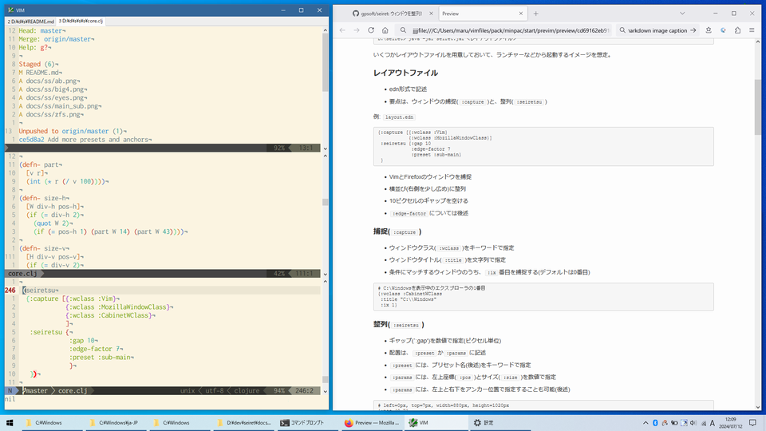
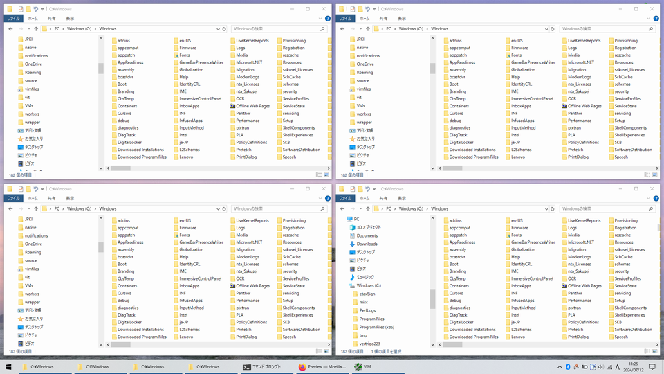
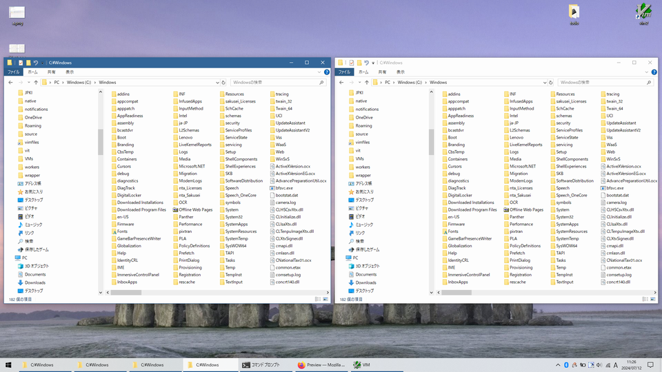
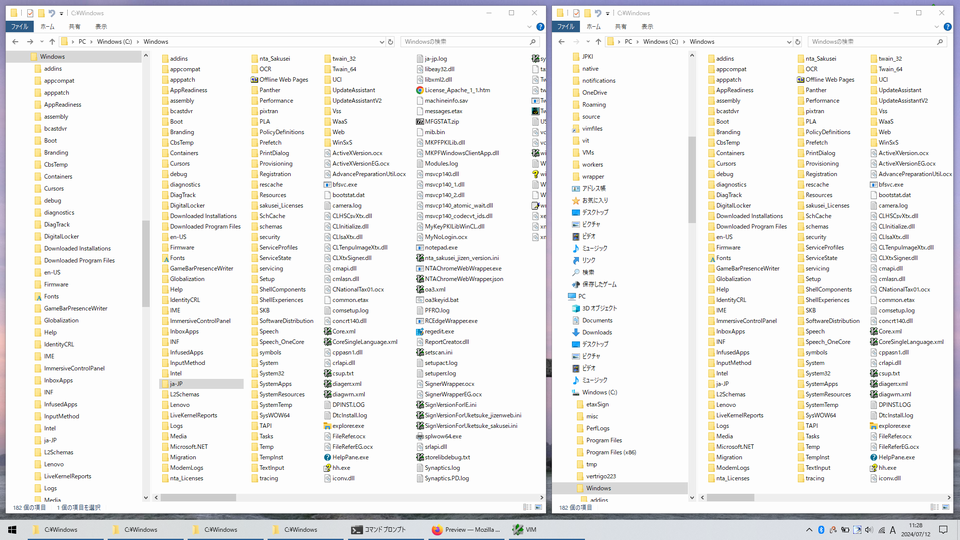
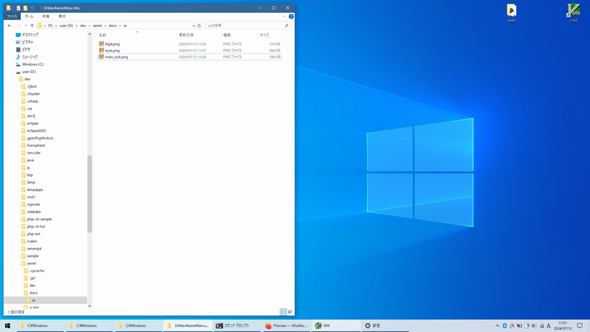
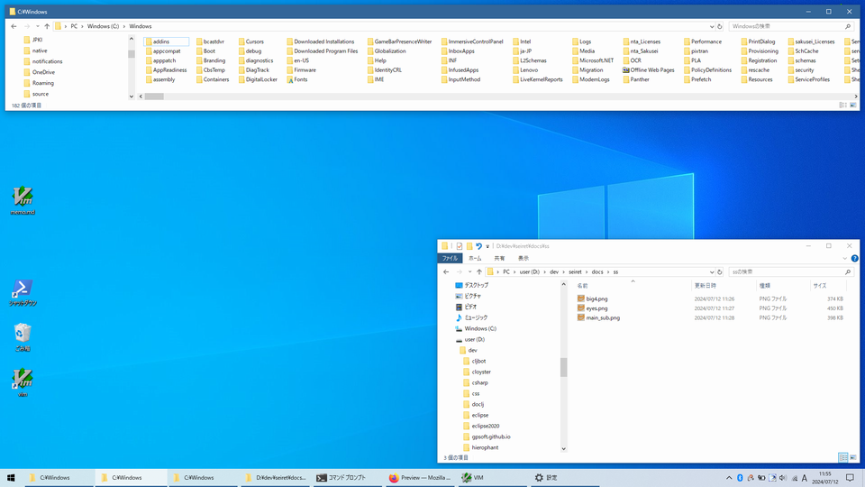

# Seiret

## 機能

- ウィンドウのレイアウトを調整する
- Windows専用

## 動機

- 普段、使うアプリは、だいたい決まっているので、ウィンドウ配置も固定したい
- 不意に(あるいは故意に)ウィンドウを動かしてしまったあと、簡単に定位置に戻したい
- タイル型ウィンドウマネージャほどの汎用性は不要
- マウスを使いたくない

## 使い方

### 実行

```powershell
D:\seiret> java -jar seiret.jar <レイアウトファイル>
```

いくつかレイアウトファイルを用意しておいて、ランチャーなどから起動するイメージを想定。

### レイアウトファイル

- edn形式で記述
- 要点は、ウィンドウの捕捉(`:capture`)と、整列(`:seiretsu`)

例: `layout.edn`
```edn
{:capture [{:wclass :Vim}
           {:wclass :MozillaWindowClass}]
 :seiretsu {:gap 10
            :edge-factor 7
            :preset :sub-main}
 }
```

- VimとFirefoxのウィンドウを捕捉
- 横並び(右側を少し広め)に整列
- 10ピクセルのギャップを空ける
- `:edge-factor`については後述



### 捕捉(`:capture`)の記述

- ウィンドウクラス(`:wclass`)をキーワードで指定
- ウィンドウタイトル(`:title`)を文字列で指定
- 条件にマッチするウィンドウのうち、`:ix`番目を捕捉する(デフォルトは0番目)

```edn
# C:\Windowsフォルダを表示中のエクスプローラの1番目
{:wclass :CabinetWClass
 :title "C:\\Windows"
 :ix 1}
```

### 整列(`:seiretsu`)の記述

- ギャップ(`:gap')を数値で指定(ピクセル単位)
- 配置は、`:preset`か`:params`に記述
- `:preset`には、プリセット名(後述)をキーワードで指定
- `:params`には、左上座標(`:pos`)とサイズ(`:size`)を数値で指定

```edn
# left=0px, top=7px, width=880px, height=1020px
{:pos [0 7]
 :size [880 1020]}
```

- `:params`には、左上と右下を、アンカー位置(後述)で指定することも可能

### ナゾの隙間(`:edge-factor`)

ウィンドウの位置やサイズを変えるために、Win32の`SetWindowPos()`を使うが、なぜか、指定したよりも、位置が右寄り、かつ幅が狭めに配置されるらしく、隙間が生じてしまう。この隙間を調整するのが、`:edge-factor`だ。手持ちの環境では7pxだったが、Windowsのバージョンによって異なる可能性もある。

### ウィンドウクラスって何?

最近はどうか知らないが、Win32の時代は、ウィンドウを開く前にまずウィンドウクラスを登録する必要があった。アプリが表示するウィンドウには、固有のウィンドウクラス名が付いているはずなので、それをキーにしてウィンドウを捕捉する。

ウィンドウクラス名を調べるには、Spy++(って今もあるのかな?)か、以下のコマンドを実行する。

```powershell
D:\seiret> java -jar seiret.jar --list
"MozillaWindowClass: gpsoft/seiret: ウィンドウを整列! ? Mozilla Firefox"
"CASCADIA_HOSTING_WINDOW_CLASS: コマンド プロンプト - java  -jar target\\seiret.jar --list"
"Vim: VIM"
"CabinetWClass: C:\\Windows"
```

### プリセット

使えるプリセット名は以下の通り。

```
:full
:side-by-side
:big-4
:eyes
:main-sub
:sub-main
:top-down
```

スクショ例:


*BIG-4*


*EYES*


*MAIN-SUB*


### アンカーによるレイアウト指定

画面全体の区分けパターンを3つ用意した。各アルファベットが区画名を表す。

4区画パターン:
```
A Y
B Z
```

9区画パターン:
```
C I V
D J W
E K X
```

6区画パターン:
```
F S
G T
H U
```

これに基づいて、ウィンドウの左上と右上の区画名をキーワードで指定する。

例えば`[:A :B]`なら、デスクトップの左半分にウィンドウが配置される。


*:params [[:A :B]]*

`[:Z]`のように、右下を省略しても良い。


*:params [[:F :S] [:Z]]*


## 開発

```powershell
PS D:\seiret> clj -M:dev

PS D:\seiret> clj -M -m seiret.core
```

## リリース

```
PS D:\seiret> clj -T:build clean
PS D:\seiret> clj -T:build uber
```
